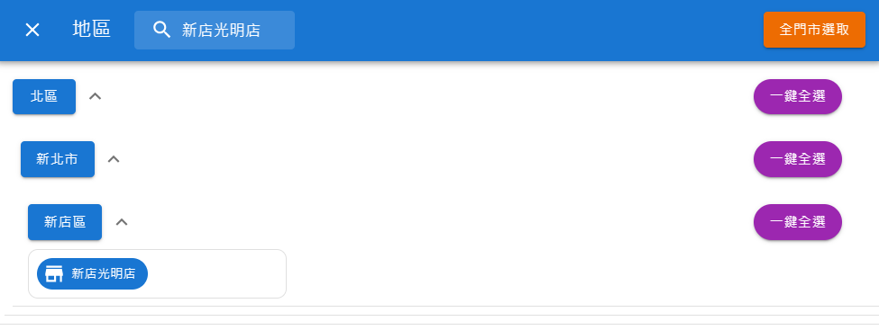
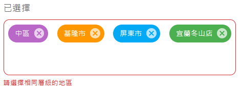

# Comebuy - Visualization of Sales

### 台灣大學 資管系 三年級 林栗綺

### 台灣大學 資管系 三年級 賴羿蓁

### 台灣大學 資管系 三年級 李昀宸

---

### 介紹

- 這個服務在做什麼？ <br>
  可以使用本系統搜尋、篩選欲知道的指定業績狀況。
- 使用、參考之第三方套件、框架、程式碼：<br>
  前端：React.js, Material UI, React Router, Styled-components, Lodash, Axios, Recharts <br>

### 安裝說明

1. 安裝前端：在 frontend 下輸入 `yarn` 安裝所需 package。

   ```
   # under frontend
   yarn
   ```

2. 建置前端 build 檔：在 frontend 下輸入 `yarn build`。

   ```
   # under frontend
   yarn build
   ```

3. 安裝 miniconda：https://repo.anaconda.com/miniconda/Miniconda3-latest-Windows-x86_64.exe

4. 建置環境

   - 在 window 左下角搜尋欄輸入 `anaconda prompt`，開啟後輸入 `conda init powershell`

     

   - 在 powershell 回到 CB_NTU_2/Comebuy/backend 下，輸入以下指令

     ```
     # under backend
     conda create --name CB_NTU_2 python=3.9.16
     conda activate CB_NTU_2
     ```

5. 安裝後端：在 backend 下輸入 `pip install -r requirements.txt` 安裝所需 package。

   ```
   # under backend
   pip install -r requirements.txt
   ```

6. 啟動：在 backend 下輸入 `uvicorn main:app --host 0.0.0.0 --port 8000`

   ```
     # under backend
     uvicorn main:app --host 0.0.0.0 --port 8000
   ```

### 功能說明

1. 基本搜尋：

   - 時間範圍：選擇完日期後，系統會彈出可選擇時間的方框，預設為 00:00 ~ 23:59（全天），可根據需求選擇更詳細的時間區段。

   - 地區：

     

     - 預設為全台，點開全台後會彈出視窗選擇細分區域，若下層有被選擇則其所有上層會有 highlight 顯示，且僅能取消最下層。

       e.g. 若選擇了「新店光明店」，則「北區」、「新北市」、「新店區」皆有 <span style="background-color:#1976D2;color:white;font-weight:bold; padding:2px">highlight</span> 顯示，且點選以上三者任意都不能取消「新店光明店」，<span style="color:red; font-weight:bold">唯一取消途徑是再次點選「新店光明店」</span>。

     - 搜尋功能：在搜尋框中輸入欲查詢名稱，會將每個層級中有符合的選項列出。

       e.g. 若輸入「光明店」，符合的條件有「三峽光明店」、「土城光明店」、「新店光明店」，則系統會列出：「北區 &rarr; 新北市 &rarr; 三峽區 &rarr; 三峽光明店」、「北區 &rarr; 新北市 &rarr; 土城區 &rarr; 土城光明店」、「北區 &rarr; 新北市 &rarr; 新店區 &rarr; 新店光明店」。

     - 快捷功能：

       - <span style="background-color:#ED6C02;color:white;font-weight:bold; padding:2px">全門市選取</span>：點選後會依照目前面板顯示選取全部門市

         e.g. 若搜尋了「光明店」而改變面板，面板上只顯示「三峽光明店」、「土城光明店」、「新店光明店」，則按下<span style="background-color:#ED6C02;color:white;font-weight:bold; padding:2px">全門市選取</span>將指選取此三者。

       - <span style="background-color:#9C27B0;color:white;font-weight:bold; padding:2px">一鍵全選</span>：所有「非店家層級」展開後右手邊都會有<span style="background-color:#9C27B0;color:white;font-weight:bold; padding:2px">一鍵全選</span>，按下將會選取目前面板顯示下該層級之下一層級的所有選項。

         e.g. 若按下「北市」的<span style="background-color:#9C27B0;color:white;font-weight:bold; padding:2px">一鍵全選</span>則會選取「新北市、台北市、新竹市...」；若搜尋了「光明店」而改變面板，面板上「北區」以下只有「新北市」，則僅會選取「新北市」。

     - 已選擇區域：

       - 顯示目前已選擇區域，按叉叉可取消選取。
       - 防呆系統：系統僅能選擇相同層級的地區選項，若選擇不同層級則會出現錯誤提示。

         

   - 品項：

     - 指定飲品：若選擇指定飲品則該飲品的飲品種類會顯示該飲品種類以降有被選擇；所該飲品種類以下所有飲品都被選擇，則也會有全部選擇的提示圖案。

     - 指定飲品種類：若選擇飲品種類，則類似快捷鍵功能：所有屬於該飲品種類的飲品都會被選取。

   - 甜冰口料：屬於額外條件。若有任一條件有被選擇會出現「分別飲品統整」

     - <span style="color:red; font-weight:bold">分別飲品統整</span>：當切換為「分別飲品統整」，則所出現的數據分析會以<span style="font-weight:bold">指定飲品</span>為分母，反之則以<span style="font-weight:bold">全部飲品</span>為分母。

2. 數據呈現：

   - 總表：呈現符合交易日期、門市名稱、飲品、額外條件之全品項總杯數、飲品杯數、杯數占比、全品項總金額、飲品金額及金額占比，默認順序為門市名稱、飲品、交易日期。

     總表功能：

     - 排序：僅能按照單一欄位排序。
     - 篩選：僅能篩選單一欄位。
     - 匯出 csv 檔：基本上和系統上呈現的表格相似，僅額外條件無法呈現符合之選項。
       <br>
       <br>

   - 過去若干年趨勢圖：以折線圖呈現該選取時段歷年的銷量變化，點選圖例可隱藏線條。
   - 過去若干時段趨勢：以長條圖呈現該選取時段同一區間往前推算之銷量變化趨勢
     可調整參數：

     - 年：從今年開始（包含今年）往前推 n 年所呈現的銷量變化
     - 佔比： 調整欲知道銷量變化以何種方式計算
       - 杯數佔比
       - 金額佔比
     - 顏色：可調整線條顏色

### Enhancement

1. 飲品搜尋功能
